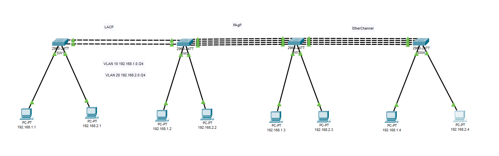

# Etherchannel-LACP
 Create Etherchannel - LACP
 


## EtherChannel Overview

EtherChannel is a link aggregation technology used in networking to combine multiple  
physical links into a single logical link. This increases bandwidth, provides redundancy,   


## Key Features:

**Increased Bandwidth** – Multiple links act as one, improving throughput.  
**Redundancy** – If one link fails, traffic is redistributed to the remaining links.  
**Load Balancing** – Traffic is distributed across all active links.  
**Faster Convergence** – Compared to Spanning Tree Protocol (STP) blocking redundant links. 

## EtherChannel Protocols
### PAgP (Port Aggregation Protocol)  
Cisco proprietary, automatically manages EtherChannel.   
Auto (passive), Desirable (active)  
Both sides must be Desirable or Auto-Desirable to form a channel.  

### LACP (Link Aggregation Control Protocol)  
IEEE standard (802.3ad), works on multi-vendor networks.  
**Passive** (listens), **Active** (initiates)  
Both sides must be Active-Active or Active-Passive to form a channel. 

### EtherChannel

**Static** (On mode) – No negotiation, directly creates an EtherChannel.  
Both ends must be set to On, otherwise, no link is formed.  


# EtherChannel LACP Configuration Steps 

 
 
 
Set IP addresses on PCs.  
Configure switch interfaces and create VLAN 10 and VLAN 20.  
Combine interfaces into a single EtherChannel.  
Enable VLAN 10 and VLAN 20 on the port-channel interface.  


### PC1-PC8

**SW1** 
192.168.1.1 192.168.2.1
**SW2**
192.168.1.2 192.168.2.2
**SW3** 
192.168.1.3 192.168.2.3
**SW4**
192.168.1.4 192.168.2.4

### SW1

```
enable
configure terminal
hostname SW1
interface FastEthernet0/ 1
switchport mode access
switchport access vlan 10
exit
interface FastEthernet0/ 2
switchport mode access
switchport access vlan 20
exit
```


### Etherchannel SW1
```
interface rangeGigabitEthernet0/1 - 2 
channel-group 1 mode active
exit
interface Port-channel1
switchport mode trunk
switchport trunk allowed vlan 10,20
exit
exit
copy running-config startup-config
```

### SW2
```
enable
configure terminal
hostname SW2
interface FastEthernet0/ 1
switchport mode access
switchport access vlan 10
exit
interface FastEthernet0/ 2
switchport mode access
switchport access vlan 20
exit
```

### Etherchannel SW2

```
interface rangeGigabitEthernet0/1 - 2
channel-group 1 mode passive
exit
interface Port-channel1
switchport mode trunk
switchport trunk allowed vlan 10,20
exit
exit
```


### Test

show etherchannel summary
```
Flags:  D - down        P - in port-channel
        I - stand-alone s - suspended
        H - Hot-standby (LACP only)
        R - Layer3      S - Layer2
        U - in use      f - failed to allocate aggregator
        u - unsuitable for bundling
        w - waiting to be aggregated
        d - default port


Number of channel-groups in use: 1
Number of aggregators:           1

Group  Port-channel  Protocol    Ports
------+-------------+-----------+----------------------------------------------

1      Po1(SU)           LACP   Gig0/1(P) Gig0/2(P) 
```


# EtherChannel PAgP 


### SW2

```
enable
configure terminal
interface rangeFastEthernet0/3. 0 - 6 (f0/3-6)
channel-group 2 mode auto
exit
interface Port-channel2
switchport mode trunk
switchport trunk allowed vlan 10,20
exit
exit
copy running-config startup-config
```

### SW3

```
enable
configure terminal
hostname SW3
interface rangeFastEthernet0/3. 0 - 6 (f0/3-6)
channel-group 2 mode desirable
exit
interface Port-channel2
switchport mode trunk
switchport trunk allowed vlan 10,20
exit
interface FastEthernet0/ 1
switchport mode access
switchport access vlan 10
exit
interface FastEthernet0/ 2
switchport mode access
switchport access vlan 20
exit
exit
```


### Test

```
Flags:  D - down        P - in port-channel
        I - stand-alone s - suspended
        H - Hot-standby (LACP only)
        R - Layer3      S - Layer2
        U - in use      f - failed to allocate aggregator
        u - unsuitable for bundling
        w - waiting to be aggregated
        d - default port


Number of channel-groups in use: 1
Number of aggregators:           1

Group  Port-channel  Protocol    Ports
------+-------------+-----------+----------------------------------------------

2      Po2(SU)           PAgP   Fa0/3(P) Fa0/4(P) Fa0/5(P) Fa0/6(P) 
```

## Etherchannel

### SW3
```
enable
configure terminal
interface rangeFastEthernet0/21. 0 - 24
channel-group 3 mode on
exit
interface Port-channel3
switchport mode trunk
switchport trunk allowed vlan 10,20
exit
exit
copy running-config startup-config
```

### SW4
```
enable
configure terminal
hostname SW4
interface rangeFastEthernet0/21. 0 - 24
channel-group 3 mode on
exit
interface Port-channel3
switchport mode trunk
switchport trunk allowed vlan 10,20
exit
interface FastEthernet0/ 1
switchport mode access
switchport access vlan 10
exit
interface FastEthernet0/ 2
switchport mode access
switchport access vlan 20
exit
exit
copy running-config startup-config
```





